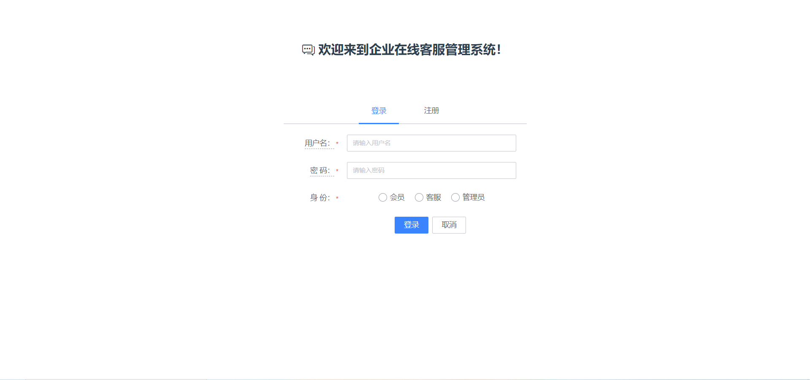
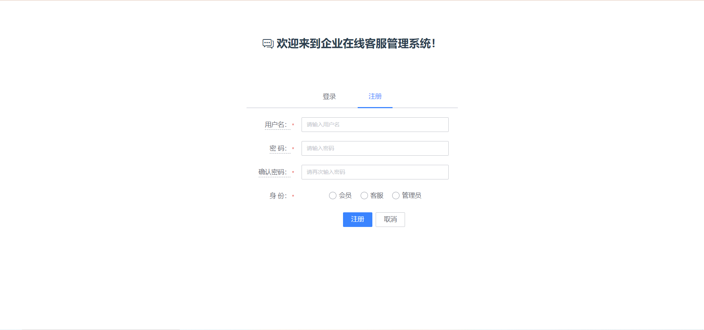
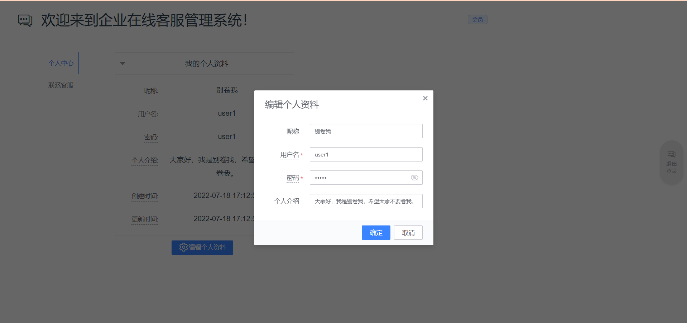
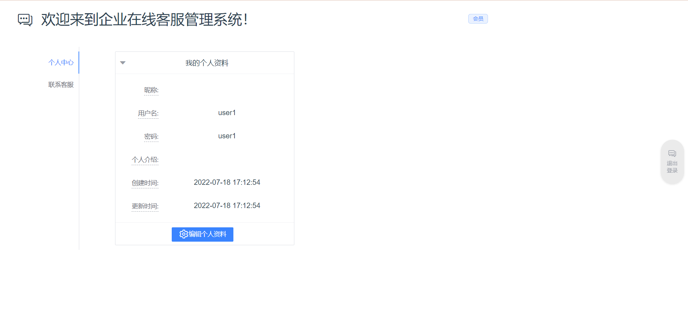
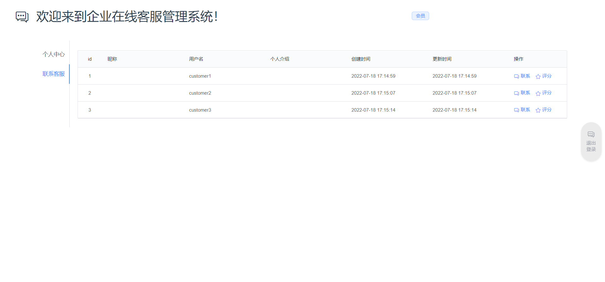
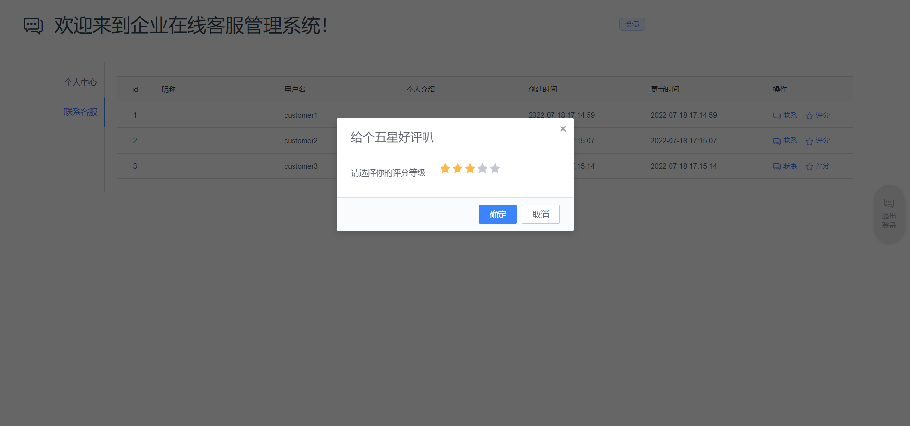
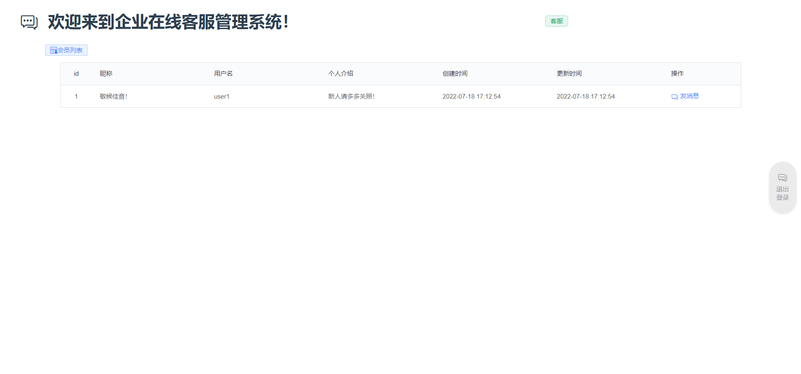
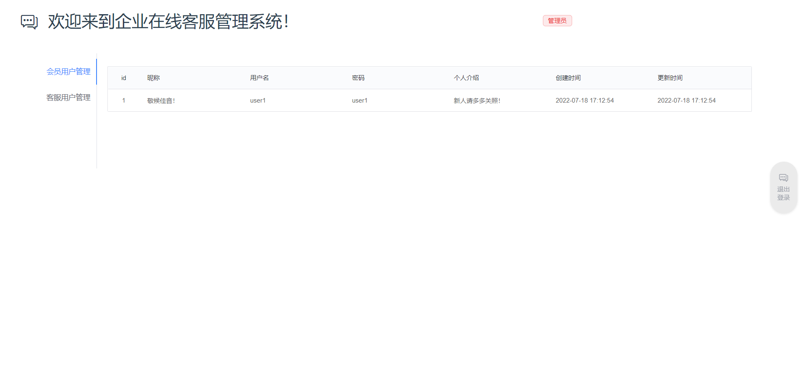
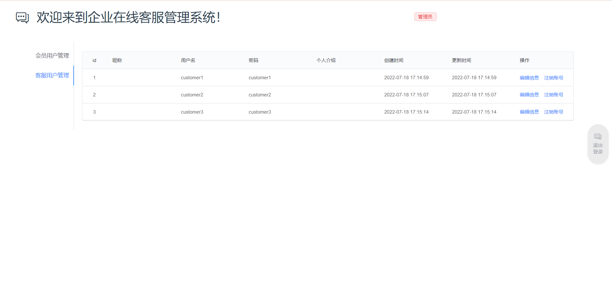

# 基于Python的企业在线客服管理系统

基于`python`的企业在线客服管理系统的设计与实现首先用户通过注册登录后能与在线客服进行在线即时聊天，若在线客服解决不了，可以通过对话转接系统转接到其他客服进行解答，在对话结束后用户可对客服进行五星评分和评价。

## 用户注册/登录

用户通过注册成为会员，经过登录才能与在线客服进行联系。

## 客户端

在线对话以及对话完成后进行评价。

## 客户端注册/登录

客服进行注册和登录。

## 客服端

客服在线回复，能与客户文本聊天，一对多聊天。

## 管理端注册/登录

管理员进行注册登录。

## 管理端

可以查看所有客服信息，可以修改客服信息

# 效果图

## 登录

## 注册

## 编辑个人资料

## 个人中心

## 联系客服

## 聊天对话框

## 评分

## 客服主页

## 会员管理

## 客服管理

# 开发框架及技术栈

- 后端框架——`Django3.2.4`
- 前端框架——`vue2.5.2`
- 数据交互——`vue-axios3.4.1`
- `UI`组件库——`bk-magic-vue2.4.7`
- 数据库——`MySQL5.7`

